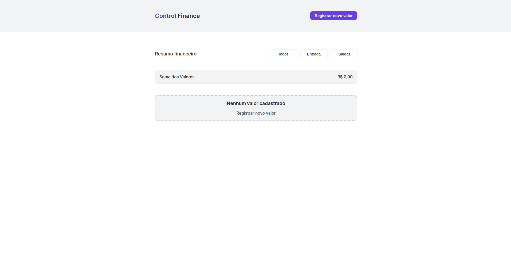

# Control Finance

Bem-vindo ao README do projeto Control Finance! Este projeto visa fornecer uma solução de controle financeiro para ajudar os usuários a gerenciar suas finanças de forma eficaz. O aplicativo permite registrar transações financeiras, visualizar um resumo financeiro e acompanhar entradas e saídas de dinheiro.

## 🚀 Tecnologias Utilizadas
- HTML5
- CSS3
- JavaScript
- Biblioteca Toastify-JS

## 🌐 Navegação
- Página Inicial: Página Inicial
- Página de Resumo Financeiro: Resumo Financeiro
- Página de Registro de Transações: Registro de Transações

## 🎨 Design
O design do aplicativo foi desenvolvido para proporcionar uma experiência intuitiva e eficiente aos usuários. Os estilos foram criados utilizando CSS para garantir uma apresentação visual agradável e responsiva.

## ⚙️ Funcionalidades Principais
- Registro de Valores: Registre suas transações financeiras, especificando o valor e o tipo (entrada ou saída).
- Resumo Financeiro: Visualize um resumo financeiro que mostra a soma total dos valores registrados, diferenciando entre entradas e saídas.
- Visualização de Transações: Veja suas transações em uma lista, exibindo o valor e o tipo (entrada ou saída).

## 📸 Imagens do Projeto

## 🤝 Contribuição
Este projeto é aberto para contribuições! Se você encontrar problemas, bugs ou tiver sugestões de melhorias, sinta-se à vontade para abrir uma issue ou enviar um pull request. Esperamos ansiosamente pela sua colaboração.

## 📝 Licença
Este projeto está licenciado sob a Licença MIT.

---
**Desenvolvido por [Lucas Capella](https://www.linkedin.com/in/lucas-capella-608012202/) | capellaaa7@gmail.com**